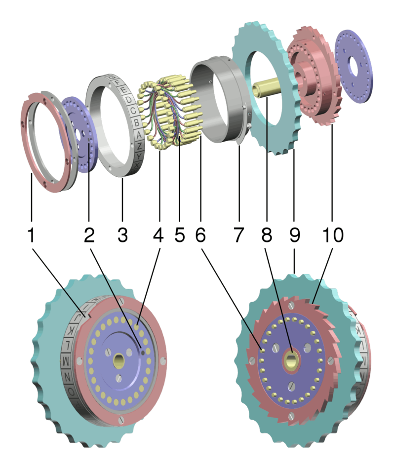

# enigma
Simulation of the Enigma Machine in Python

## Research

### Rotors

The rotor simply jumbles the letters of the aplphabet through criss-cross wiring. There were 8 different rotors that could swap out.

The rotor layouts are as follows:

	ABCDEFGHIJKLMNOPQRSTUVWXYZ
- I:	EKMFLGDQVZNTOWYHXUSPAIBRCJ
- II:	AJDKSIRUXBLHWTMCQGZNPYFVOE
- III:	BDFHJLCPRTXVZNYEIWGAKMUSQO
- IV:	ESOVPZJAYQUIRHXLNFTGKDCMWB
- V:	VZBRGITYUPSDNHLXAWMJQOFECK
- VI:	JPGVOUMFYQBENHZRDKASXLICTW
- VII:	NZJHGRCXMYSWBOUFAIVLPEKQDT
- VIII:	FKQHTLXOCBJSPDZRAMEWNIUYGV

#### Reflector

On the left of the three rotors, a 'reflector' or Umkehrwalze is implemented. For simplicity, reclector A was chosen.

- Reflector A - EJMZALYXVBWFCRQUONTSPIKHGD
